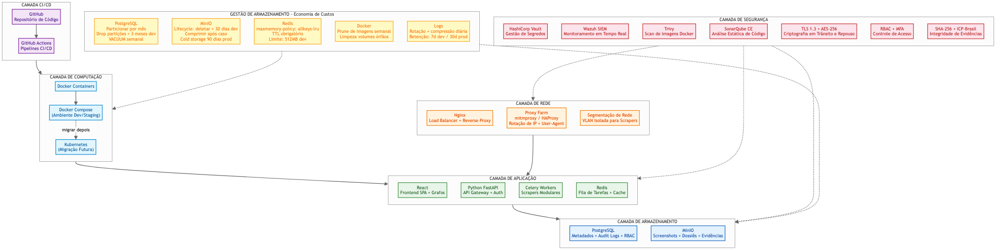
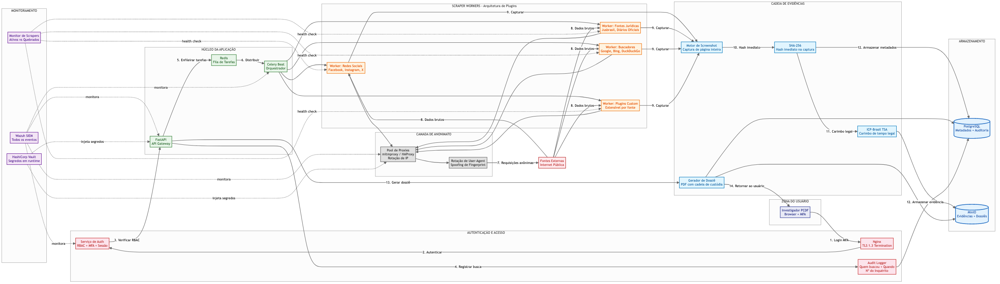
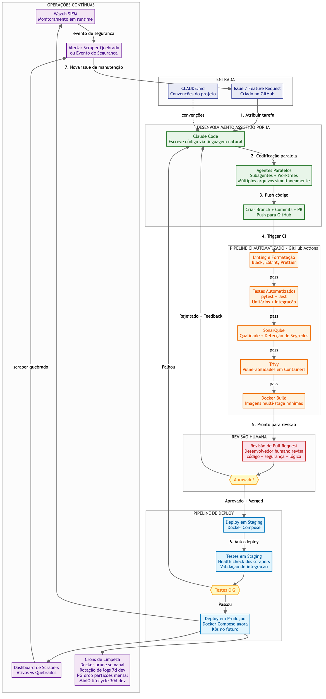

# Buscador OSINT Automatizado - Diagramas de Arquitetura

> PCDF + UnB | Stack 100% Open-Source | Custo Mínimo

---

## Diagrama 1: Infraestrutura (Tech Stack)

```mermaid
graph TB
    subgraph COMPUTE["CAMADA DE COMPUTAÇÃO"]
        direction TB
        DC["Docker Containers"]
        DCO["Docker Compose<br/>(Ambiente Dev/Staging)"]
        K8S["Kubernetes<br/>(Migração Futura)"]
        DC --> DCO
        DCO -.->|"migrar depois"| K8S
    end

    subgraph NETWORK["CAMADA DE REDE"]
        direction TB
        NGINX["Nginx<br/>Load Balancer + Reverse Proxy"]
        PROXY_FARM["Proxy Farm<br/>mitmproxy / HAProxy<br/>Rotação de IP + User-Agent"]
        NET_SEG["Segmentação de Rede<br/>VLAN Isolada para Scrapers"]
    end

    subgraph APP["CAMADA DE APLICAÇÃO"]
        direction TB
        REACT["React<br/>Frontend SPA + Grafos"]
        FASTAPI["Python FastAPI<br/>API Gateway + Auth"]
        CELERY["Celery Workers<br/>Scrapers Modulares"]
        REDIS["Redis<br/>Fila de Tarefas + Cache"]
    end

    subgraph STORAGE["CAMADA DE ARMAZENAMENTO"]
        direction TB
        PG["PostgreSQL<br/>Metadados + Audit Logs + RBAC"]
        MINIO["MinIO<br/>Screenshots + Dossiês + Evidências"]
    end

    subgraph SECURITY["CAMADA DE SEGURANÇA"]
        direction TB
        VAULT["HashiCorp Vault<br/>Gestão de Segredos"]
        WAZUH["Wazuh SIEM<br/>Monitoramento em Tempo Real"]
        TRIVY["Trivy<br/>Scan de Imagens Docker"]
        SONAR["SonarQube CE<br/>Análise Estática de Código"]
        TLS["TLS 1.3 + AES-256<br/>Criptografia em Trânsito e Repouso"]
        RBAC_MFA["RBAC + MFA<br/>Controle de Acesso"]
        EVIDENCE["SHA-256 + ICP-Brasil<br/>Integridade de Evidências"]
    end

    subgraph CICD["CAMADA CI/CD"]
        direction TB
        GITHUB["GitHub<br/>Repositório de Código"]
        GH_ACTIONS["GitHub Actions<br/>Pipelines CI/CD"]
        GITHUB --> GH_ACTIONS
    end

    subgraph CLEANUP["GESTÃO DE ARMAZENAMENTO - Economia de Custos"]
        direction TB
        PG_POL["PostgreSQL<br/>• Particionar por mês<br/>• Drop partições > 3 meses em dev<br/>• VACUUM semanal"]
        MINIO_POL["MinIO<br/>• Lifecycle: deletar objetos > 30 dias em dev<br/>• Comprimir após encerramento de caso<br/>• Cold storage após 90 dias em prod"]
        REDIS_POL["Redis<br/>• maxmemory-policy: allkeys-lru<br/>• TTL obrigatório em todas as chaves<br/>• Limite: 512MB em dev"]
        DOCKER_POL["Docker<br/>• Prune de imagens semanal<br/>• Limpeza de volumes órfãos"]
        LOG_POL["Logs<br/>• Rotação + compressão diária<br/>• Retenção máxima: 7 dias em dev<br/>• 30 dias em prod"]
    end

    COMPUTE --> APP
    NETWORK --> APP
    APP --> STORAGE
    SECURITY -.-> APP
    SECURITY -.-> STORAGE
    SECURITY -.-> NETWORK
    CICD --> COMPUTE
    CLEANUP -.-> STORAGE
    CLEANUP -.-> COMPUTE

    classDef compute fill:#e1f5fe,stroke:#0288d1,stroke-width:2px,color:#01579b
    classDef network fill:#fff3e0,stroke:#f57c00,stroke-width:2px,color:#e65100
    classDef app fill:#e8f5e9,stroke:#388e3c,stroke-width:2px,color:#1b5e20
    classDef storage fill:#e3f2fd,stroke:#1565c0,stroke-width:2px,color:#0d47a1
    classDef security fill:#fce4ec,stroke:#c62828,stroke-width:2px,color:#b71c1c
    classDef cicd fill:#f3e5f5,stroke:#7b1fa2,stroke-width:2px,color:#4a148c
    classDef cleanup fill:#fff9c4,stroke:#f9a825,stroke-width:2px,color:#f57f17

    class DC,DCO,K8S compute
    class NGINX,PROXY_FARM,NET_SEG network
    class REACT,FASTAPI,CELERY,REDIS app
    class PG,MINIO storage
    class VAULT,WAZUH,TRIVY,SONAR,TLS,RBAC_MFA,EVIDENCE security
    class GITHUB,GH_ACTIONS cicd
    class PG_POL,MINIO_POL,REDIS_POL,DOCKER_POL,LOG_POL cleanup
```

---

## Diagrama 2: Arquitetura do Sistema (Fluxo de Dados)

```mermaid
graph LR
    subgraph USER["ZONA DO USUÁRIO"]
        INV["Investigador PCDF<br/>Browser + MFA"]
    end

    subgraph AUTH["AUTENTICAÇÃO E ACESSO"]
        NGINX_GW["Nginx<br/>TLS 1.3 Termination"]
        AUTH_SVC["Serviço de Auth<br/>RBAC + MFA + Sessão"]
        AUDIT["Audit Logger<br/>Quem buscou + Quando<br/>Nº do Inquérito"]
    end

    subgraph CORE["NÚCLEO DA APLICAÇÃO"]
        API["FastAPI<br/>API Gateway"]
        REDIS_Q["Redis<br/>Fila de Tarefas"]
        ORCH["Celery Beat<br/>Orquestrador"]
    end

    subgraph WORKERS["SCRAPER WORKERS - Arquitetura de Plugins"]
        W1["Worker: Redes Sociais<br/>Facebook, Instagram, X"]
        W2["Worker: Fontes Jurídicas<br/>Jusbrasil, Diários Oficiais"]
        W3["Worker: Buscadores<br/>Google, Bing, DuckDuckGo"]
        W4["Worker: Plugins Custom<br/>Extensível por fonte"]
    end

    subgraph ANON["CAMADA DE ANONIMATO"]
        PROXY["Pool de Proxies<br/>mitmproxy / HAProxy<br/>Rotação de IP"]
        UA["Rotação de User-Agent<br/>Spoofing de Fingerprint"]
    end

    subgraph EVID["CADEIA DE EVIDÊNCIAS"]
        SCREEN["Motor de Screenshot<br/>Captura de página inteira"]
        HASH["SHA-256<br/>Hash imediato na captura"]
        TSA["ICP-Brasil TSA<br/>Carimbo de tempo legal"]
        DOSSIER["Gerador de Dossiê<br/>PDF com cadeia de custódia"]
    end

    subgraph STORE["ARMAZENAMENTO"]
        PG_DB[("PostgreSQL<br/>Metadados + Auditoria")]
        MINIO_S3[("MinIO<br/>Evidências + Dossiês")]
    end

    subgraph MON["MONITORAMENTO"]
        WAZUH_S["Wazuh SIEM<br/>Todos os eventos"]
        VAULT_S["HashiCorp Vault<br/>Segredos em runtime"]
        HEALTH["Monitor de Scrapers<br/>Ativos vs Quebrados"]
    end

    EXT["Fontes Externas<br/>Internet Pública"]

    INV -->|"1. Login MFA"| NGINX_GW
    NGINX_GW -->|"2. Autenticar"| AUTH_SVC
    AUTH_SVC -->|"3. Verificar RBAC"| API
    API -->|"4. Registrar busca"| AUDIT
    API -->|"5. Enfileirar tarefas"| REDIS_Q
    REDIS_Q -->|"6. Distribuir"| ORCH
    ORCH --> W1
    ORCH --> W2
    ORCH --> W3
    ORCH --> W4

    W1 --> PROXY
    W2 --> PROXY
    W3 --> PROXY
    W4 --> PROXY
    PROXY --> UA
    UA -->|"7. Requisições anônimas"| EXT

    EXT -->|"8. Dados brutos"| W1
    EXT -->|"8. Dados brutos"| W2
    EXT -->|"8. Dados brutos"| W3
    EXT -->|"8. Dados brutos"| W4

    W1 -->|"9. Capturar"| SCREEN
    W2 -->|"9. Capturar"| SCREEN
    W3 -->|"9. Capturar"| SCREEN
    W4 -->|"9. Capturar"| SCREEN

    SCREEN -->|"10. Hash imediato"| HASH
    HASH -->|"11. Carimbo legal"| TSA
    TSA -->|"12. Armazenar evidência"| MINIO_S3
    HASH -->|"12. Armazenar metadados"| PG_DB

    API -->|"13. Gerar dossiê"| DOSSIER
    DOSSIER --> PG_DB
    DOSSIER --> MINIO_S3
    DOSSIER -->|"14. Retornar ao usuário"| INV

    AUDIT --> PG_DB
    WAZUH_S -.->|"monitora"| AUTH_SVC
    WAZUH_S -.->|"monitora"| API
    WAZUH_S -.->|"monitora"| ORCH
    WAZUH_S -.->|"monitora"| PROXY
    VAULT_S -.->|"injeta segredos"| API
    VAULT_S -.->|"injeta segredos"| PROXY
    HEALTH -.->|"health check"| W1
    HEALTH -.->|"health check"| W2
    HEALTH -.->|"health check"| W3
    HEALTH -.->|"health check"| W4

    classDef user fill:#e8eaf6,stroke:#283593,stroke-width:2px,color:#1a237e
    classDef auth fill:#fce4ec,stroke:#c62828,stroke-width:2px,color:#b71c1c
    classDef core fill:#e8f5e9,stroke:#2e7d32,stroke-width:2px,color:#1b5e20
    classDef worker fill:#fff3e0,stroke:#ef6c00,stroke-width:2px,color:#e65100
    classDef anon fill:#e0e0e0,stroke:#616161,stroke-width:2px,color:#212121
    classDef evidence fill:#e1f5fe,stroke:#0277bd,stroke-width:2px,color:#01579b
    classDef store fill:#e3f2fd,stroke:#1565c0,stroke-width:3px,color:#0d47a1
    classDef monitor fill:#f3e5f5,stroke:#6a1b9a,stroke-width:2px,color:#4a148c
    classDef external fill:#ffebee,stroke:#b71c1c,stroke-width:2px,color:#b71c1c

    class INV user
    class NGINX_GW,AUTH_SVC,AUDIT auth
    class API,REDIS_Q,ORCH core
    class W1,W2,W3,W4 worker
    class PROXY,UA anon
    class SCREEN,HASH,TSA,DOSSIER evidence
    class PG_DB,MINIO_S3 store
    class WAZUH_S,VAULT_S,HEALTH monitor
    class EXT external
```

---

## Diagrama 3: Ciclo de Desenvolvimento (IA + Revisão Humana)

```mermaid
graph TD
    subgraph INPUT["ENTRADA"]
        ISSUE["Issue / Feature Request<br/>Criado no GitHub"]
        CLAUDE_MD["CLAUDE.md<br/>Convenções do projeto"]
    end

    subgraph AI["DESENVOLVIMENTO ASSISTIDO POR IA"]
        CC["Claude Code<br/>Escreve código via linguagem natural"]
        PARALLEL["Agentes Paralelos<br/>Subagentes + Worktrees<br/>Múltiplos arquivos simultaneamente"]
        BRANCH["Criar Branch + Commits + PR<br/>Push para GitHub"]
    end

    subgraph CI["PIPELINE CI AUTOMATIZADO - GitHub Actions"]
        LINT["Linting e Formatação<br/>Black, ESLint, Prettier"]
        TESTS["Testes Automatizados<br/>pytest + Jest<br/>Unitários + Integração"]
        SONAR_CHECK["SonarQube<br/>Qualidade + Detecção de Segredos"]
        TRIVY_CHECK["Trivy<br/>Vulnerabilidades em Containers"]
        BUILD["Docker Build<br/>Imagens multi-stage mínimas"]
    end

    subgraph REVIEW["REVISÃO HUMANA"]
        PR["Revisão de Pull Request<br/>Desenvolvedor humano revisa<br/>código + segurança + lógica"]
        DEC1{{"Aprovado?"}}
    end

    subgraph DEPLOY["PIPELINE DE DEPLOY"]
        STG["Deploy em Staging<br/>Docker Compose"]
        STG_TEST["Testes em Staging<br/>Health check dos scrapers<br/>Validação de integração"]
        DEC2{{"Testes OK?"}}
        PROD["Deploy em Produção<br/>Docker Compose agora<br/>K8s no futuro"]
    end

    subgraph OPS["OPERAÇÕES CONTÍNUAS"]
        WAZUH_OP["Wazuh SIEM<br/>Monitoramento em runtime"]
        SCRAPER_OP["Dashboard de Scrapers<br/>Ativos vs Quebrados"]
        STORAGE_OP["Crons de Limpeza<br/>• Docker prune semanal<br/>• Rotação de logs 7d dev<br/>• PG drop partições mensal<br/>• MinIO lifecycle 30d dev"]
        ALERT_OP["Alerta: Scraper Quebrado<br/>ou Evento de Segurança"]
    end

    ISSUE -->|"1. Atribuir tarefa"| CC
    CLAUDE_MD -.->|"convenções"| CC
    CC -->|"2. Codificação paralela"| PARALLEL
    PARALLEL -->|"3. Push código"| BRANCH

    BRANCH -->|"4. Trigger CI"| LINT
    LINT -->|"pass"| TESTS
    TESTS -->|"pass"| SONAR_CHECK
    SONAR_CHECK -->|"pass"| TRIVY_CHECK
    TRIVY_CHECK -->|"pass"| BUILD

    BUILD -->|"5. Pronto para revisão"| PR
    PR --> DEC1

    DEC1 -->|"Rejeitado + Feedback"| CC
    DEC1 -->|"Aprovado + Merged"| STG

    STG -->|"6. Auto-deploy"| STG_TEST
    STG_TEST --> DEC2
    DEC2 -->|"Falhou"| CC
    DEC2 -->|"Passou"| PROD

    PROD --> WAZUH_OP
    PROD --> SCRAPER_OP
    PROD --> STORAGE_OP
    SCRAPER_OP -->|"scraper quebrado"| ALERT_OP
    WAZUH_OP -->|"evento de segurança"| ALERT_OP
    ALERT_OP -->|"7. Nova issue de manutenção"| ISSUE

    classDef input fill:#e8eaf6,stroke:#283593,stroke-width:2px,color:#1a237e
    classDef ai fill:#e8f5e9,stroke:#2e7d32,stroke-width:2px,color:#1b5e20
    classDef ci fill:#fff3e0,stroke:#ef6c00,stroke-width:2px,color:#e65100
    classDef review fill:#fce4ec,stroke:#c62828,stroke-width:2px,color:#b71c1c
    classDef deploy fill:#e1f5fe,stroke:#0277bd,stroke-width:2px,color:#01579b
    classDef ops fill:#f3e5f5,stroke:#6a1b9a,stroke-width:2px,color:#4a148c
    classDef decision fill:#fff9c4,stroke:#f9a825,stroke-width:2px,color:#f57f17

    class ISSUE,CLAUDE_MD input
    class CC,PARALLEL,BRANCH ai
    class LINT,TESTS,SONAR_CHECK,TRIVY_CHECK,BUILD ci
    class PR review
    class STG,STG_TEST,PROD deploy
    class WAZUH_OP,SCRAPER_OP,STORAGE_OP,ALERT_OP ops
    class DEC1,DEC2 decision
```

---

## Justificativa do Tech Stack

Todas as tecnologias foram escolhidas priorizando **custo zero de licenciamento**, **maturidade**, e **facilidade de migração futura**.

| Tecnologia | Escolhida | Alternativas Descartadas | Justificativa |
|-----------|-----------|-------------------------|---------------|
| **Frontend** | React | Vue, Angular | Maior ecossistema de bibliotecas de grafos (D3.js, Vis.js, Cytoscape.js) essenciais para visualização de vínculos. Maior pool de desenvolvedores disponíveis. Angular seria overkill para a aplicação. |
| **Backend API** | FastAPI (Python) | Django, Flask | Performance assíncrona nativa (essencial para orquestrar scrapers). Tipagem automática com Pydantic. Documentação OpenAPI gerada automaticamente. Django seria pesado demais; Flask não tem suporte async nativo. |
| **Fila de Tarefas** | Redis + Celery | RabbitMQ | Redis serve como broker E cache em um único serviço (menor footprint de infraestrutura). Celery é o padrão de facto para filas em Python. RabbitMQ adicionaria complexidade sem benefício claro para este volume. |
| **Banco de Dados** | PostgreSQL | MySQL, MongoDB | Suporte robusto a JSON (para metadados flexíveis) + ACID completo (essencial para auditoria legal). Particionamento nativo por data para gestão de retenção. MongoDB não garante ACID e MySQL tem JSON inferior. |
| **Object Storage** | MinIO | Sistema de arquivos local | Compatível com S3 — permite migração futura para AWS/Azure sem mudança de código. Lifecycle policies nativas para limpeza automática. Sistema de arquivos local não escala e não tem políticas de retenção. |
| **SIEM** | Wazuh | ELK Stack (Elastic SIEM) | 100% open-source (GPLv2) sem restrições de licença. Módulos de compliance integrados (LGPD, GDPR). Menor consumo de recursos que ELK. ELK tem licença SSPL que pode ser restritiva. |
| **Orquestração** | Docker Compose | Kubernetes | Para fase de desenvolvimento e MVP, Docker Compose é suficiente e drasticamente mais simples. K8s seria overengineering para 5-10 usuários simultâneos. Migração para K8s planejada para fase de produção em escala. |
| **CI/CD** | GitHub + GitHub Actions | Jenkins, GitLab CI | Custo zero (free tier suporta o projeto). Sem necessidade de infraestrutura adicional self-hosted. Integração nativa com o repositório. Jenkins exigiria servidor dedicado; GitLab CI exigiria instância self-hosted. |
| **Load Balancer** | Nginx | Traefik, HAProxy | Mais leve em recursos que alternativas. Configuração simples e bem documentada. Serve simultaneamente como reverse proxy e terminador TLS. Traefik é mais complexo de configurar; HAProxy não serve arquivos estáticos. |
| **Gestão de Segredos** | HashiCorp Vault | SOPS, Sealed Secrets | Interface web para gestão; rotação automática de chaves; auditoria de acesso a segredos. SOPS é apenas para arquivos estáticos; Sealed Secrets depende de Kubernetes. |
| **Scan de Containers** | Trivy | Clair, Anchore | Mais rápido e simples de integrar no CI. Scan offline sem necessidade de banco de dados. Clair requer infraestrutura adicional; Anchore é mais complexo. |
| **Análise de Código** | SonarQube CE | CodeClimate, Semgrep | Detecta segredos no código (crítico para tokens de APIs). Dashboard de qualidade integrado. Community Edition é gratuita. CodeClimate é SaaS (dados sensíveis não devem sair do ambiente). |

---

## Estimativa de Custos

### Custos de Implementação (Único)

| Item | Descrição | Estimativa (R$) |
|------|-----------|----------------|
| **Hardware (Servidor de Dev)** | 1x servidor: 8 vCPU, 32GB RAM, 500GB SSD — pode ser máquina existente no CyLab/UnB ou compra mínima | R$ 0 (existente) a R$ 8.000 |
| **Hardware (Servidor de Staging)** | Pode compartilhar com dev inicialmente via Docker Compose com profiles separados | R$ 0 (compartilhado) |
| **Certificado TLS** | Let's Encrypt para endpoints externos; certificados auto-assinados para comunicação interna | R$ 0 |
| **Licenças de Software** | Todos open-source: React, FastAPI, Redis, PostgreSQL, MinIO, Wazuh, Vault, Trivy, SonarQube CE, Nginx | R$ 0 |
| **GitHub** | Free tier: repositórios privados ilimitados, 2.000 min/mês de Actions | R$ 0 |
| **Domínio interno** | Uso de DNS interno da PCDF/UnB ou arquivo hosts | R$ 0 |
| **Configuração inicial** | Setup de Docker, compose files, CI pipelines, SIEM, Vault — estimativa de 80-120 horas de desenvolvimento | R$ 0 (equipe UnB) a R$ 24.000 (se terceirizado a R$ 200/h) |
| **TOTAL IMPLEMENTAÇÃO** | | **R$ 0 a R$ 32.000** |

### Custos Operacionais Mensais

| Item | Descrição | Estimativa Mensal (R$) |
|------|-----------|----------------------|
| **Serviço de Proxies** | Pool de 50-100 IPs rotativos para anonimato operacional (serviço pago inevitável para qualidade) | R$ 200 a R$ 800 |
| **Energia elétrica** | Servidor on-premises rodando 24/7 (estimativa incremental) | R$ 50 a R$ 150 |
| **Armazenamento** | Com políticas de cleanup agressivas: ~50GB em dev, ~200GB em prod. Discos existentes devem suportar. | R$ 0 (existente) |
| **Internet** | Banda para scraping — uso da rede institucional UnB/PCDF | R$ 0 (existente) |
| **GitHub Actions** | Free tier: 2.000 min/mês — suficiente para builds e CI | R$ 0 |
| **Claude Code (IA)** | Assinatura para desenvolvimento assistido por IA | R$ 100 a R$ 500 |
| **Manutenção de scrapers** | Scrapers quebram com mudanças de layout — estimativa de 20-40h/mês de manutenção | R$ 0 (equipe UnB) a R$ 8.000 (se terceirizado) |
| **Backup** | Backup incremental local com rsync/restic (gratuito) em disco secundário | R$ 0 |
| **TOTAL OPERACIONAL** | | **R$ 350 a R$ 9.450/mês** |

### Cenários de Custo

| Cenário | Implementação | Operação Mensal | Descrição |
|---------|--------------|-----------------|-----------|
| **Mínimo** | R$ 0 | R$ 350/mês | Hardware existente no CyLab, equipe UnB faz tudo, proxy básico |
| **Realista** | R$ 8.000 | R$ 1.500/mês | Compra de servidor dedicado, proxy intermediário, equipe UnB |
| **Máximo** | R$ 32.000 | R$ 9.450/mês | Hardware novo, terceirização de configuração e manutenção |

### Estratégias de Redução de Custo Implementadas

1. **100% open-source**: Zero custo de licenciamento em todo o stack
2. **Docker Compose em vez de K8s**: Elimina necessidade de cluster de 3+ nós
3. **GitHub free tier**: Sem servidor de CI self-hosted
4. **Políticas agressivas de storage em dev**: Limpeza automática reduz necessidade de disco
5. **Compartilhamento dev/staging**: Um único servidor com Docker Compose profiles
6. **Infraestrutura temporária**: Tudo containerizado para migração futura sem refatoração
7. **IA para desenvolvimento**: Reduz horas de codificação manual, acelerando entregas
