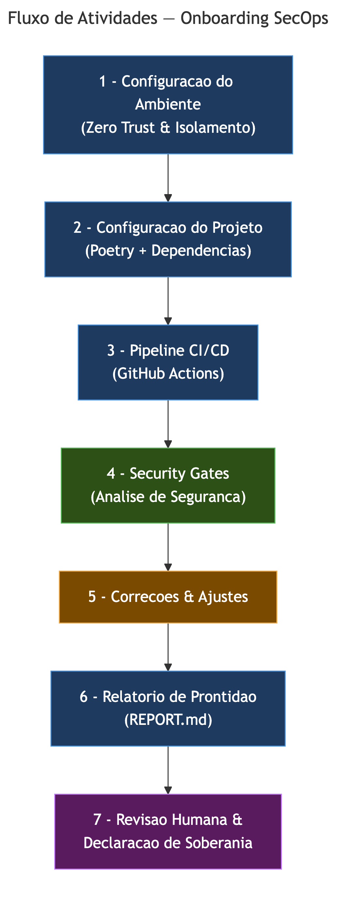
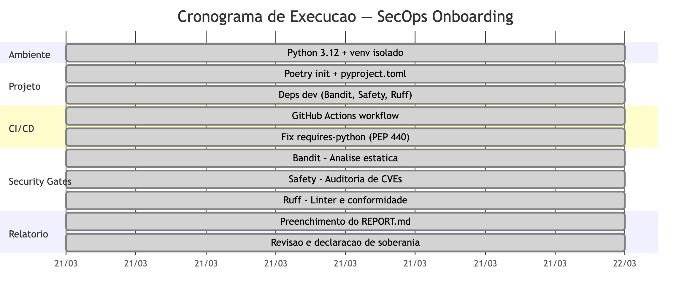
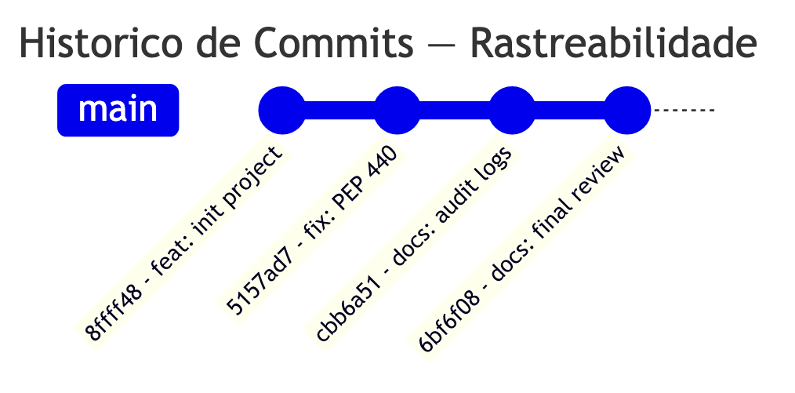
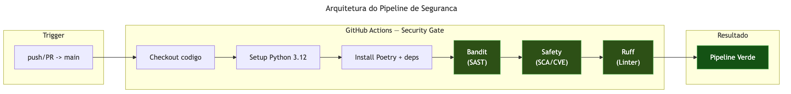

# Diagrama de Planejamento — Onboarding SecOps

**Disciplina:** Engenharia de Produto de Software (FGA0316) - 2026.1
**Aluno:** Mauricio Machado Fernandes Filho | **Matrícula:** 200014959

## Visão Geral do Fluxo de Atividades

## Detalhamento das Etapas (Linha do Tempo)

## Histórico de Commits (Rastreabilidade)

| Commit | Mensagem | Etapa |
|--------|----------|-------|
| `8ffff48` | `feat: initialize SecOps onboarding project with security tooling` | Ambiente + Projeto + CI |
| `5157ad7` | `fix: sync poetry.lock with updated requires-python constraint` | Correção PEP 440 |
| `cbb6a51` | `docs: fill report with audit logs and CI link` | Relatório + Security Gates |
| `6bf6f08` | `docs: atualiza relatório com matrícula, data, observações e correção de IA` | Revisão Final |

## Arquitetura do Pipeline de Segurança

## Legenda

| Cor | Significado |
|-----|-------------|
| Azul | Etapas de configuração e documentação |
| Verde | Security gates (análise de segurança) |
| Laranja | Correções e ajustes |
| Roxo | Revisão humana (Human-in-the-loop / CISSP Domain 8) |
