# Design System — Buscador OSINT Automatizado · PCDF

> **Disciplina:** Engenharia de Produto de Software (EPS) · UnB  
> **Projeto:** Buscador OSINT Automatizado — Polícia Civil do Distrito Federal  
> **Versão:** 1.0.0  

---

## Visão Geral

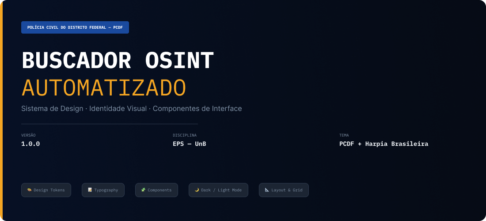

O design system do **Buscador OSINT Automatizado** garante consistência visual, acessibilidade e identidade institucional da PCDF em toda a interface. A identidade é construída sobre o azul institucional e o dourado da PCDF.

---

## 🎨 Design Tokens

### Paleta de Cores — Primary (Azul Institucional PCDF)

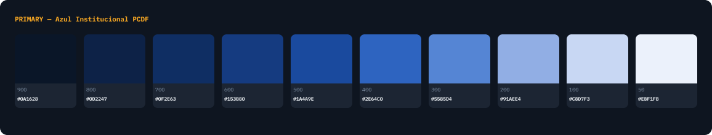

### Secondary — Dourado Institucional

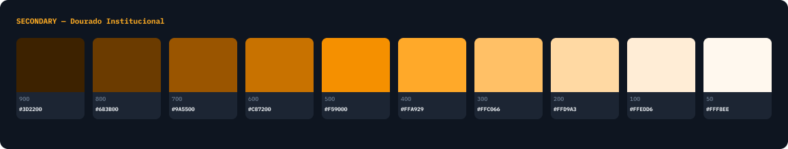

### Status — Success

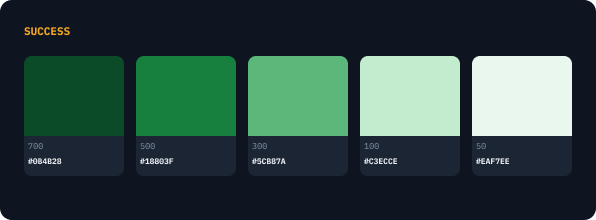

### Status — Warning

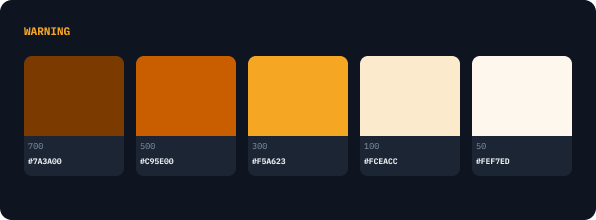

### Status — Error

### Neutral

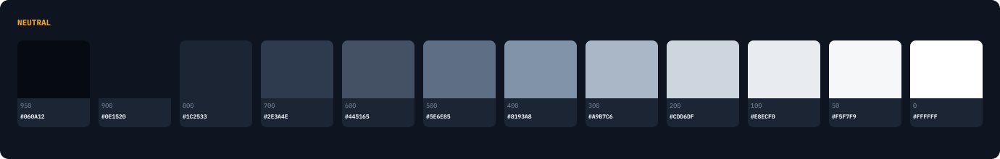

### Spacing Scale (Base unit: 4px)

Escala: `4px · 8px · 12px · 16px · 24px · 32px · 48px · 64px`

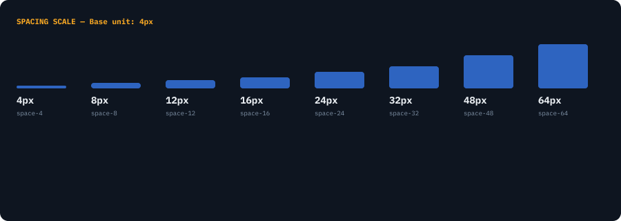

### Border Radius

Tokens: `none (0) · sm (4px) · md (8px) · lg (12px) · xl (16px) · full (9999px)`

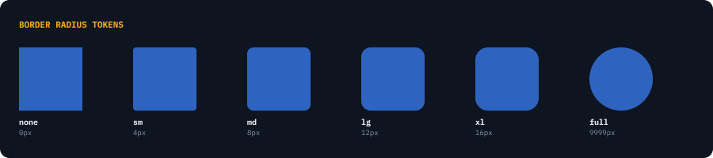

### Z-Index & Breakpoints

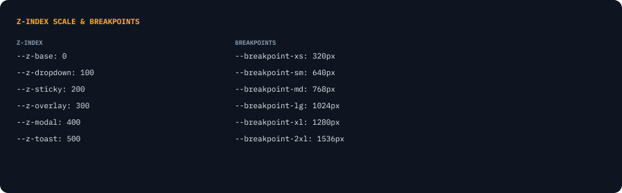

---

## 📝 Tipografia

### Headings — IBM Plex Mono (Display)

Escala: `H1 (48px) · H2 (36px) · H3 (28px) · H4 (22px) · H5 (18px) · H6 (14px)`

*(Veja frame `HEADINGS — IBM Plex Mono` no Figma — Página: 📝 Typography)*

### Body & Utility Types — Inter + IBM Plex Mono

Estilos: `Body LG · Body MD · Body SM · Caption · Overline · Code`

*(Veja frame `BODY & UTILITY TYPES` no Figma — Página: 📝 Typography)*

---

## 🧩 Componentes

### Botões

Variantes: `primary · secondary · gold (CTA) · danger · ghost` | Tamanhos: `LG (44px) · SM (32px)`

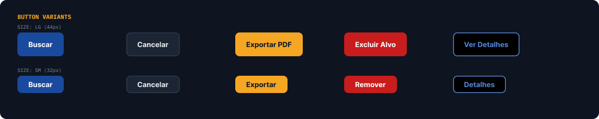

### Form Inputs

Campos: `CPF (mono) · Nome/Vulgo · E-mail · Telefone (mono) · Busca Federada`

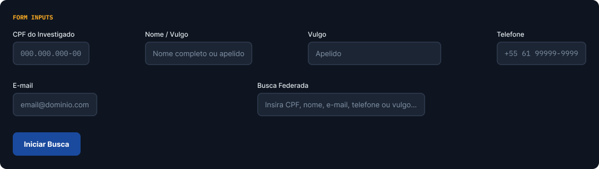

### Data Table — Resultados da Busca OSINT

Status badges: `CONFIRMADO · ANALISANDO · PENDENTE · DESCARTADO`

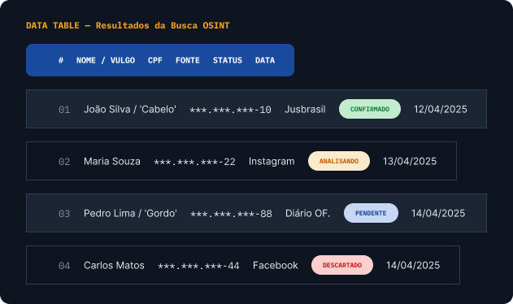

### Alerts, Badges & Status Indicators

Alerts: `success · warning · error · info` | Badges: `ATIVO · INATIVO · PRIORIDADE · NOVO · OSINT · SIGILOSO`

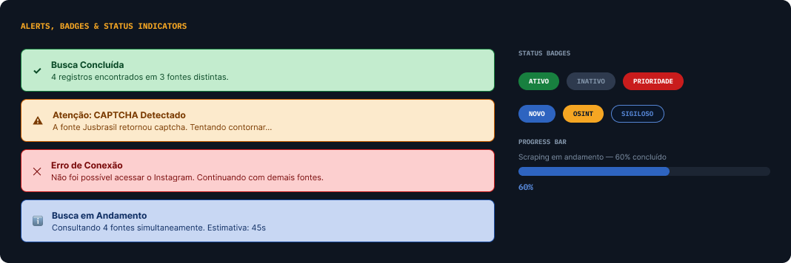

### Cards — Result & Stats

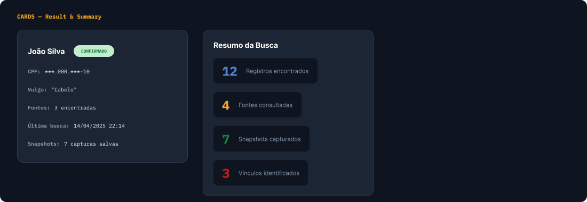

### Navigation — Sidebar + Tabs + Breadcrumbs

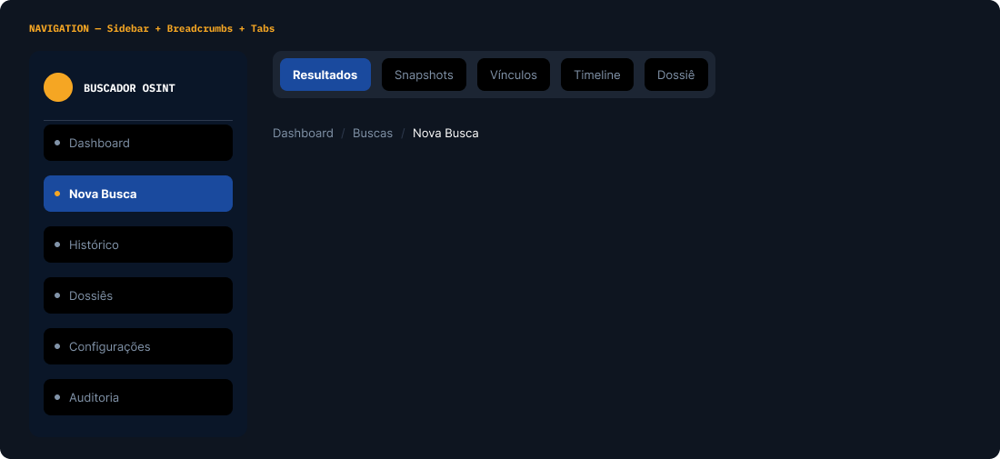

---

## 🌙 Dark Mode / Light Mode

### Dark Mode (Padrão operacional)

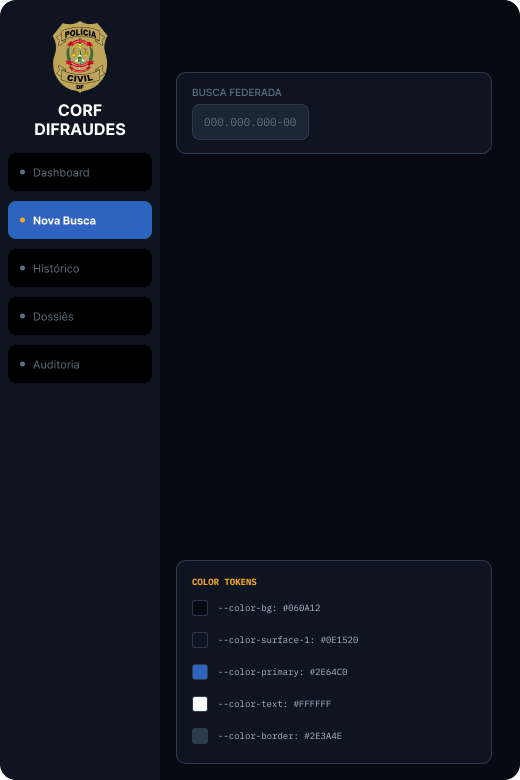

### Light Mode

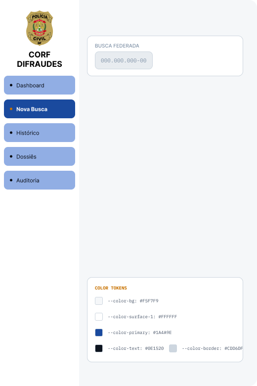

---

## ♿ WCAG 2.1 AA — Auditoria de Contraste

**26 pares de cor testados · 3 cores corrigidas após auditoria · Mínimo 4.5:1 em todos os pares**

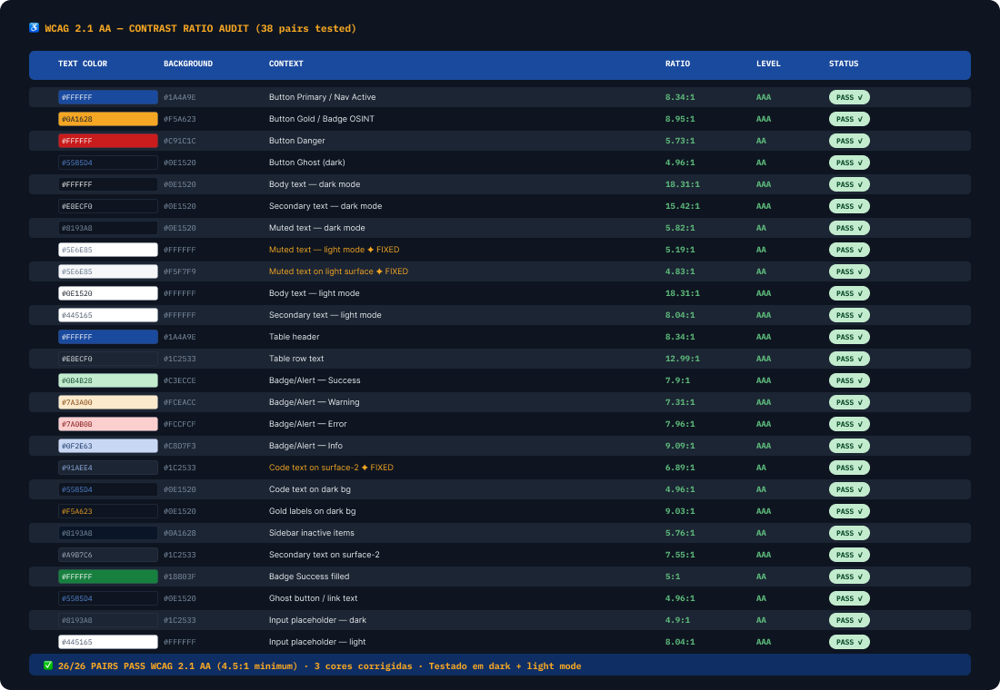

### Correções aplicadas após auditoria

| Par original | Contexto | Ratio antes | Correção | Ratio depois |
|---|---|---|---|---|
| `#8193A8` / `#FFFFFF` | Texto muted — light mode | 3.15:1 ❌ | `#5E6E85` | 5.19:1 ✅ |
| `#8193A8` / `#F5F7F9` | Texto muted — light surface | 2.93:1 ❌ | `#5E6E85` | 4.83:1 ✅ |
| `#5585D4` / `#1C2533` | Code text em surface-2 | 4.18:1 ❌ | `#91AEE4` | 6.89:1 ✅ |

---

## 🔧 Figma Variables

### Coleção: PCDF Design Tokens

| Token | Dark | Light |
|-------|------|-------|
| `color/bg/primary` | `#060A12` | `#F5F7F9` |
| `color/bg/surface-1` | `#0E1520` | `#FFFFFF` |
| `color/bg/surface-2` | `#1C2533` | `#E8ECF0` |
| `color/bg/surface-3` | `#2E3A4E` | `#CDD6DF` |
| `color/brand/primary` | `#2E64C0` | `#1A4A9E` |
| `color/brand/gold` | `#F5A623` | `#C87200` |
| `color/text/primary` | `#FFFFFF` | `#0E1520` |
| `color/text/secondary` | `#A9B7C6` | `#445165` |
| `color/text/muted` | `#8193A8` | `#5E6E85` ✦ |
| `color/border/default` | `#2E3A4E` | `#CDD6DF` |
| `color/border/focus` | `#2E64C0` | `#1A4A9E` |
| `color/status/success` | `#5CB87A` | `#18803F` |
| `color/status/warning` | `#F5A623` | `#C95E00` |
| `color/status/error` | `#EF5350` | `#C91C1C` |
| `color/status/info` | `#5585D4` | `#1A4A9E` |

> ✦ Valor corrigido para WCAG AA (era `#8193A8`, ratio 3.15:1 ❌)

### Coleção: Spacing

`spacing/4=4px · spacing/8=8px · spacing/12=12px · spacing/16=16px · spacing/24=24px · spacing/32=32px · spacing/48=48px · spacing/64=64px`

### Coleção: Border Radius

`radius/none=0px · radius/sm=4px · radius/md=8px · radius/lg=12px · radius/xl=16px · radius/full=9999px`

---

### Para acessar o design system completo, acesse a seguir:  
[Visualizar no Figma](https://www.figma.com/design/gAotIdNAKBThXKEZS1CyCb/EPS---PCDF?node-id=0-1&t=0wOZH1yc3o2loZtE-1)

*Design system criado para o projeto Buscador OSINT Automatizado — EPS/UnB · Grupo 13 · PCDF.*  
*Todas as cores validadas contra WCAG 2.1 AA. Todos os componentes construídos em Auto Layout no Figma.*

*Revisado por Alexandre Junior*
