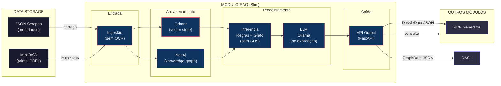
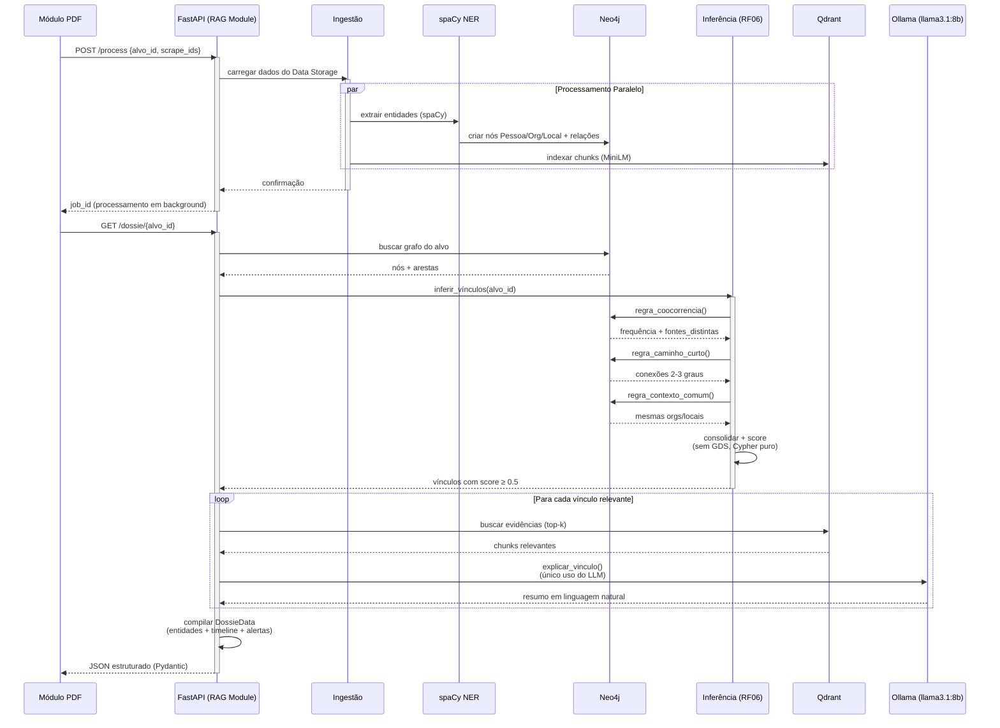

# RAG Module

Este é o módulo RAG (Retrieval-Augmented Generation) do Buscador OSINT Automatizado.

## Pré-requisitos

- Python 3.12+
- Poetry
- Docker e Docker Compose

## Instalação

1.  **Baixar as dependências do módulo RAG:**

    **Nota para usuários Linux (Ubuntu):** 
    Caso deseje ativar o ambiente virtual manualmente:
    ```bash
    source .venv/bin/activate
    ```
    
    Certifique-se de estar no diretório `rag_module`:
    ```bash
    cd rag_module
    poetry install
    ```

2.  **Configurar o ambiente:**

    Crie um arquivo `.env` baseado no `.env.example`:
    ```bash
    cp .env.example .env
    ```

## Execução

1.  **Executar o Docker Compose:**

    Inicie os serviços dependentes (Neo4j, Qdrant, Redis, Ollama):
    ```bash
    docker-compose up -d
    ```

2.  **Executar o RAG Module:**

    Inicie a API FastAPI:
    ```bash
    poetry run uvicorn src.main:app --reload
    ```

    A API estará disponível em `http://localhost:8000`.
    O endpoint de health check pode ser acessado em `http://localhost:8000/api/v1/health`.

    neo4j disponível em http://localhost:7474
    qdrant disponível em http://localhost:6333
    redis disponível em http://localhost:6379
    ollama disponível em http://localhost:11434

## Stack

| Categoria | Tecnologia | Justificativa |
|-----------|-----------|---------------|
| **API** | FastAPI + Pydantic v2 | Contrato limpo com outros módulos |
| **Graph DB** | Neo4j (sem GDS) | Consultas Cypher + algoritmos manuais |
| **Vector DB** | Qdrant | Busca semântica simples |
| **Embeddings** | `paraphrase-multilingual-MiniLM-L12-v2` via sentence-transformers | Leve, PT-BR, CPU-friendly |
| **NER** | spaCy `pt_core_news_lg` | Entidades padrão + custom rules |
| **LLM** | Ollama (local) | **Apenas** para explicar vínculos |
| **Framework** | LangChain | Mais simples que LlamaIndex |

---

## Arquitetura



### Diagrama de Sequência



---

## Fluxo do Módulo RAG - Versão Simplificada

### 1. Ingestão de Dados (Assíncrona)

| Etapa | Ferramenta | Descrição |
|-------|-----------|-----------|
| Recepção de requisição | FastAPI + Pydantic | Validação do payload com IDs dos scrapes |
| Carregamento de dados | Python + boto3/minio | Leitura de JSON e metadados do Data Storage |
| Divisão de texto | LangChain TextSplitter | Chunking semântico simples (sem overlap complexo) |
| Geração de embeddings | sentence-transformers | Modelo `paraphrase-multilingual-MiniLM-L12-v2` |
| Indexação vetorial | Qdrant | Armazenamento de chunks com metadados (fonte, data, alvo_id) |

**Execução:** Background task via Celery/Redis, retorna `job_id` para polling.

---

### 2. Extração de Entidades

| Etapa | Ferramenta | Descrição |
|-------|-----------|-----------|
| NER básico | spaCy `pt_core_news_lg` | Entidades PER, ORG, LOC |
| Padrões customizados | spaCy Matcher | Vulgos, apelidos, facções (regex rules) |
| Deduplicação simples | Python (set/dict) | Normalização de texto lowercase, remoção de duplicatas exatas |

**Sem:** GLiNER (zero-shot), Splink (entity resolution), OCR (fora de escopo).

---

### 3. Construção do Grafo

| Etapa | Ferramenta | Descrição |
|-------|-----------|-----------|
| Conexão com banco | neo4j-python-driver | Driver oficial síncrono/async |
| Criação de nós | Cypher CREATE/MERGE | Pessoa, Organizacao, Local, Evento |
| Criação de arestas | Cypher com propriedades | COOCORRE, MENCIONA, MEMBRO_DE, FREQUENTA |
| Propriedades das arestas | JSON no Neo4j | fonte, data, contexto_id, peso |

**Schema exemplo:**
```cypher
(:Pessoa {id, nome, tipo, cpf_mask, vulgo})
-[:COOCORRE {fonte, data, contexto_id, peso}]->
(:Pessoa)
```

**Sem:** Neo4j GDS (algoritmos de grafos complexos).

---

### 4. Inferência de Vínculos (RF06)

**Endpoint:** `GET /vinculos/{alvo_id}` (chamado internamente pelo `/dossie`)

| Etapa | Ferramenta | Descrição |
|-------|-----------|-----------|
| Regra 1: Co-ocorrência | Cypher query | `MATCH (a)-[r:COOCORRE]-(b)` com agregação COUNT e COLLECT DISTINCT |
| Regra 2: Caminho curto | Cypher com pattern | `MATCH (a)-[:COOCORRE*2]-(b)` para 2-3 graus |
| Regra 3: Contexto comum | Cypher com múltiplos MATCH | Mesmas organizações, locais, datas |
| Consolidação | Python (dict) | Agrupamento por pessoa_id, soma de scores |
| Scoring | Python (float) | `score_total = min(soma_regras, 1.0)` |
| Filtragem | Python (list comprehension) | Threshold >= 0.5 |

**Cálculo de score:**
- Co-ocorrência: `frequencia * sqrt(num_fontes_distintas)`
- Caminho curto: `forca_caminho * 0.3` (penalidade distância)
- Contexto: `orgs * 0.4 + locais * 0.2`

**Sem:** Machine learning, embeddings de grafo (Node2Vec), predição de links.

---

### 5. Geração de Explicações (Único uso do LLM)

| Etapa | Ferramenta | Descrição |
|-------|-----------|-----------|
| Recuperação de contexto | Qdrant (segunda consulta) | Busca semântica por evidências do vínculo específico |
| Montagem de prompt | Python (f-string) | Template com dados estruturados (não deixa LLM inferir) |
| Geração de texto | Ollama (local) | Modelo `llama3.1:8b`, max_tokens=200, temperature=0.3 |
| Parsing | Python (strip) | Limpeza da resposta |

**Prompt template:**
```
Você é um assistente de análise policial. Descreva o vínculo com base 
ESTRITAMENTE nos fatos fornecidos. Não invente informações.

ALVO: {alvo_nome}
PESSOA VINCULADA: {candidato_nome}
REGRAS INDICADORAS: {lista_regras}
SCORE: {score}
EVIDÊNCIAS: {top_5_evidencias}

Escreva 2-3 frases objetivas em português.
```

**Sem:** RAG complexo, agentes, cadeias multi-step, LLM para decisão.

---

### 6. Compilação do Dossiê

**Endpoint:** `GET /dossie/{alvo_id}`

| Etapa | Ferramenta | Descrição |
|-------|-----------|-----------|
| Agregação de dados | Python + Pydantic | Montagem do schema `DossieData` |
| Timeline | Python (sort) | Ordenação cronológica de eventos do Neo4j |
| Cache | Redis (opcional) | TTL de 1 hora para consultas repetidas |
| Resposta | FastAPI + Pydantic | JSON validado, pronto para consumo |

**Exemplo de Estrutura de saída:**
```json
{
  "alvo_id": "uuid",
  "alvo_nome": "string",
  "data_geracao": "ISO8601",
  "consultado_por": "matricula_pcdf",
  "entidades_relacionadas": [
    {
      "pessoa_id": "uuid",
      "nome": "string",
      "score_vinculo": 0.0-1.0,
      "tipo_vinculo": "familiar|social|profissional|criminoso",
      "fontes_distintas": ["instagram", "jusbrasil"],
      "explicacao": "string (gerada por Ollama)",
      "evidencias": [...]
    }
  ],
  "timeline": [...],
  "alertas": [...],
  "total_fontes_consultadas": int,
  "total_evidencias_processadas": int
}
```

---

## Resumo das Ferramentas por Camada

| Camada | Ferramentas | O que foi removido |
|--------|-------------|-------------------|
| API | FastAPI, Pydantic, Uvicorn | - |
| Processamento assíncrono | Celery, Redis | - |
| Banco de grafos | Neo4j Community (Cypher puro) | Neo4j GDS |
| Banco vetorial | Qdrant | - |
| Embeddings | sentence-transformers (MiniLM) | intfloat/e5-large |
| NLP/NER | spaCy `pt_core_news_lg` + Matcher | GLiNER, Splink |
| LLM | Ollama (`llama3.1:8b`) | APIs pagas, modelos grandes |
| Framework RAG | LangChain (básico) | LlamaIndex, agentes complexos |
| OCR | **Nenhum** | Tesseract, PaddleOCR |
| Entity Resolution | **Nenhum** (deduplicação simples) | Splink, Record Linkage |

---

## Estrutura de Código

```
rag_module/
├── src/
│   ├── __init__.py
│   ├── main.py                    # FastAPI
│   ├── config.py                  # Settings simples
│   │
│   ├── api/
│   │   ├── __init__.py
│   │   ├── v1/
│   │   │   ├── dossie.py
│   │   │   ├── vinculos.py
│   │   │   ├── timeline.py
│   │   │   └── health.py
│   │   └── deps.py
│   │
│   ├── schemas/
│   │   ├── __init__.py
│   │   ├── output.py             # Contratos Pydantic
│   │   └── enums.py
│   │
│   ├── services/
│   │   ├── __init__.py
│   │   │
│   │   ├── ingestion/
│   │   │   ├── __init__.py
│   │   │   ├── loader.py         # JSON do Data Storage
│   │   │   └── chunker.py        # Chunking simples
│   │   │
│   │   ├── extraction/
│   │   │   ├── __init__.py
│   │   │   └── ner_spacy.py      # spaCy
│   │   │
│   │   ├── graph/
│   │   │   ├── __init__.py
│   │   │   ├── neo4j_client.py   # Conexão
│   │   │   ├── schema.py         # Definição nós/arestas
│   │   │   └── builder.py        # Popula grafo
│   │   │
│   │   ├── inference/            # REGRAS + GRAFO
│   │   │   ├── __init__.py
│   │   │   ├── engine.py         # Orquestra inferência
│   │   │   ├── rules.py          # Heurísticas de vínculo
│   │   │   ├── cypher_queries.py # Queries de análise
│   │   │   └── scoring.py        # Score simples
│   │   │
│   │   ├── llm/                  # SÓ EXPLICAÇÃO
│   │   │   ├── __init__.py
│   │   │   ├── client.py         # Ollama wrapper
│   │   │   ├── prompts.py        # Prompts PT-BR
│   │   │   └── explainer.py      # Gera explicação de vínculos
│   │   │
│   │   └── dossie/
│   │       ├── __init__.py
│   │       └── compiler.py       # Monta DossieData
│   │
│   └── db/
│       ├── __init__.py
│       ├── neo4j_session.py
│       └── qdrant_client.py      # Básico
│
├── tests/
├── docker-compose.yml
└── requirements.txt
```

---

## Roadmap

| Sprint | Entregável | Complexidade |
|--------|-----------|--------------|
| **S1** | Setup + Ingestão JSON → Neo4j | Baixa |
| **S2** | spaCy NER + Qdrant básico | Média |
| **S3** | **Regras de inferência** (co-ocorrência, caminho curto) | Média |
| **S4** | API `/vinculos` + `/dossie` | Baixa |
| **S5** | LLM explicação (Ollama) + timeline | Baixa |
| **S6** | Integração + testes | Baixa |